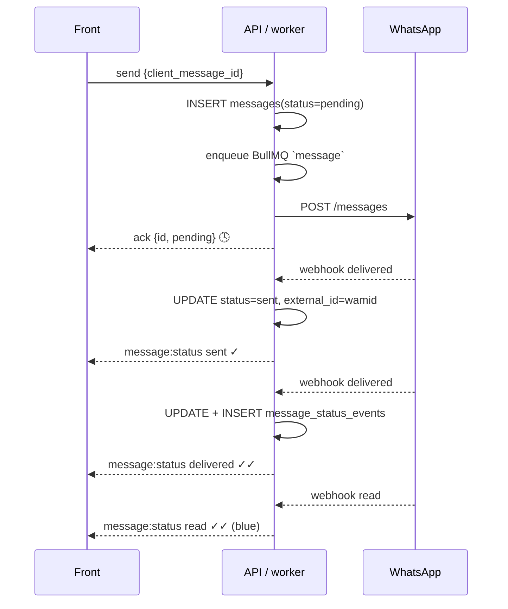

# Realtime layer (Redis + Socket.IO) — design

Design for the realtime layer: Socket.IO fan-out, Redis ephemeral state, and reconnect replay. Durable rules (schema, message lifecycle, idempotency) live in [`../database/README.md`](../database/README.md).

Goal: WhatsApp-like UX. Messages, delivery ticks, typing, assignments and notifications appear instantly, survive short disconnects, and work with several API/worker processes.

Each layer has one job:


| Layer                             | Job                                                                                 | Lost if Redis restarts?              |
| --------------------------------- | ----------------------------------------------------------------------------------- | ------------------------------------ |
| MySQL                             | durable truth: messages, statuses, notifications history, reads                     | no                                   |
| Redis Streams                     | short-lived **replay log** per member, so a reconnecting client gets what it missed | yes (rebuilt from MySQL via `/sync`) |
| Redis pub/sub (Socket.IO adapter) | **fan-out** of events to every API instance / worker                                | yes (fire-and-forget)                |
| Redis keys (HASH/ZSET/STRING)     | fast counters, presence, locks, dedupe                                              | yes (rebuilt from MySQL)             |


## 1. Transport: Socket.IO Redis adapter

- Install `@socket.io/redis-adapter` on the API and `@socket.io/redis-emitter` in BullMQ workers. Any process can then `emit` to any room, and the event reaches every connected client.
- Rooms (joined server-side on connect, **after validating the JWT**; never trust `x-user-id` / `x-company-id` sent by the client):


| Room                            | Who joins                   | Used for                                 |
| ------------------------------- | --------------------------- | ---------------------------------------- |
| `member:{memberId}`             | each socket of that member  | notifications, assignments, unread badge |
| `company:{companyId}`           | every member of the company | inbox list updates, queue changes        |
| `supervisors:{companyId}`       | admin + supervisor          | unassigned-queue alerts, live agent load |
| `conversation:{conversationId}` | sockets with that chat open | new messages, ticks, typing              |


## 2. Message lifecycle (the ticks)



- `client_message_id` (generated by the front) makes retries idempotent: a resend after a reconnect hits `UNIQUE(conversation_id, client_message_id)` and returns the existing row.
- Inbound customer message: webhook → queue `chat` → INSERT → emit `message:new` to `conversation:{id}` + `conversation:updated` to `company:{companyId}` (inbox reorder) → `HINCRBY unread:{memberId}` for the assignee → emit `unread:updated` to `member:{memberId}`.
- Status transitions are durable rules — see [`../database/README.md`](../database/README.md) (Message lifecycle).

## 3. Notifications (realtime + durable)

```
event (assigned, unassigned queue, mention, SLA breach...)
  ├─ SET notif:dedupe:{memberId}:{type}:{conversationId} 1 NX EX 600   -> already set? stop
  ├─ INSERT notifications (MySQL, history for the bell list)
  ├─ INCR notif:unread:{memberId}
  ├─ XADD events:{memberId} MAXLEN ~ 500 * type notification data {...}
  └─ emit `notification:new` to member:{memberId}
```

- The dedupe key replaces per-alert unread queries.
- Mark as read: `UPDATE notifications SET read_at` + `DECR`/`SET notif:unread:{memberId}` + emit `notification:read` (syncs other open tabs).
- Member offline (no `presence:hb`): the event is still stored; later this is where web push / email would plug in.

## 4. Reconnect and sync (no lost events)

1. Every event emitted to a member is also `XADD`-ed to `events:{memberId}` (capped, ~500 entries, plus a TTL of a few hours).
2. The front keeps the last stream id it saw. On reconnect it sends `sync { lastEventId }`.
3. The server replays with `XRANGE events:{memberId} (lastEventId +`.
4. If `lastEventId` is too old (trimmed) or Redis was flushed, the front falls back to REST: `GET /sync?since=<timestamp>`, served from MySQL (`messages.updated_at`, `notifications.created_at`).

## 5. Key map


| Key                                                  | Type                                    | Purpose                                                | Rebuild from                                       |
| ---------------------------------------------------- | --------------------------------------- | ------------------------------------------------------ | -------------------------------------------------- |
| `presence:{companyId}`                               | HASH `memberId → online | busy | away`  | live status for the UI and the assignment engine       | socket connect/disconnect                          |
| `presence:hb:{memberId}`                             | STRING, TTL 60s                         | heartbeat; expiry = offline                            | socket ping                                        |
| `presence:sockets:{memberId}`                        | SET of socket ids                       | multi-tab: offline only when the last socket leaves    | socket connect/disconnect                          |
| `agent:load:{companyId}`                             | ZSET `memberId → open assigned count`   | least-loaded agent without `COUNT(*)`                  | `conversations.assigned_member_id`                 |
| `queue:unassigned:{companyId}`                       | ZSET `conversationId → waiting_since`   | claim queue                                            | `conversations` where `assigned_member_id IS NULL` |
| `inbox:{companyId}`                                  | ZSET `conversationId → last_message_at` | inbox ordering without hitting MySQL                   | `conversations.last_message_at`                    |
| `unread:{memberId}`                                  | HASH `conversationId → count`           | per-chat unread badges                                 | `conversation_reads` + `messages`                  |
| `notif:unread:{memberId}`                            | STRING counter                          | bell badge                                             | `notifications WHERE read_at IS NULL`              |
| `notif:dedupe:{memberId}:{type}:{ref}`               | STRING, NX + TTL                        | avoid notification spam                                | ephemeral                                          |
| `events:{memberId}`                                  | STREAM, MAXLEN \~500                    | replay missed events on reconnect                      | MySQL via `/sync`                                  |
| `typing:{conversationId}:{memberId}`                 | STRING, TTL 5s                          | "typing…" indicator (emit only, never stored in MySQL) | ephemeral                                          |
| `lock:assign:{conversationId}`                       | `SET NX PX 5000`                        | prevent a double claim or assignment                   | ephemeral                                          |
| `wa:window:{conversationId}`                         | STRING, TTL = 24h from the last inbound | WA 24h free-text window check                          | `conversations.last_inbound_at`                    |
| BullMQ `chat`, `message`, `analysis`, `notification` | queues                                  | ingestion, sending, AI, notification fan-out           | —                                                  |


## 6. Socket events (server → client)


| Event                                               | Room                                     | Payload                                                        |
| --------------------------------------------------- | ---------------------------------------- | -------------------------------------------------------------- |
| `message:new`                                       | `conversation:{id}`                      | message                                                        |
| `message:status`                                    | `conversation:{id}`                      | `{ id, clientMessageId, status, at }`                          |
| `conversation:updated`                              | `company:{companyId}`                    | `{ id, lastMessage, lastMessageAt, status, assignedMemberId }` |
| `conversation:assigned` / `conversation:unassigned` | `member:{id}`, `supervisors:{companyId}` | `{ conversationId, memberId }`                                 |
| `typing`                                            | `conversation:{id}`                      | `{ conversationId, memberId | customer, isTyping }`            |
| `unread:updated`                                    | `member:{id}`                            | `{ conversationId, count }`                                    |
| `notification:new` / `notification:read`            | `member:{id}`                            | notification / `{ id }`                                        |
| `presence:updated`                                  | `company:{companyId}`                    | `{ memberId, status }`                                         |
| `sentiment:updated`                                 | `conversation:{id}`                      | analysis result                                                |


Rule: **write MySQL first, then Redis, then emit.** If the emit is lost, the stream or `/sync` recovers it. If Redis is lost, every key above can be rebuilt from MySQL.